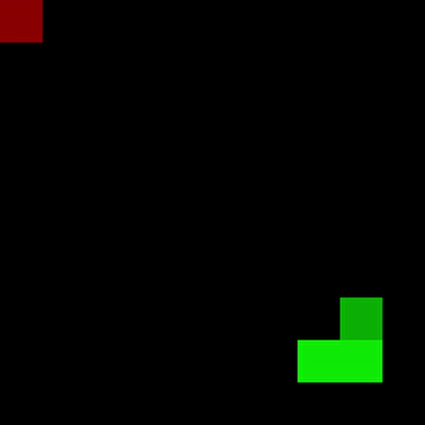
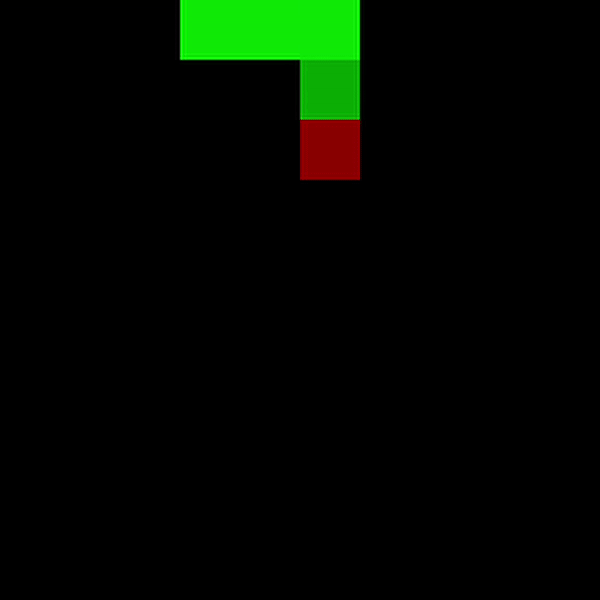
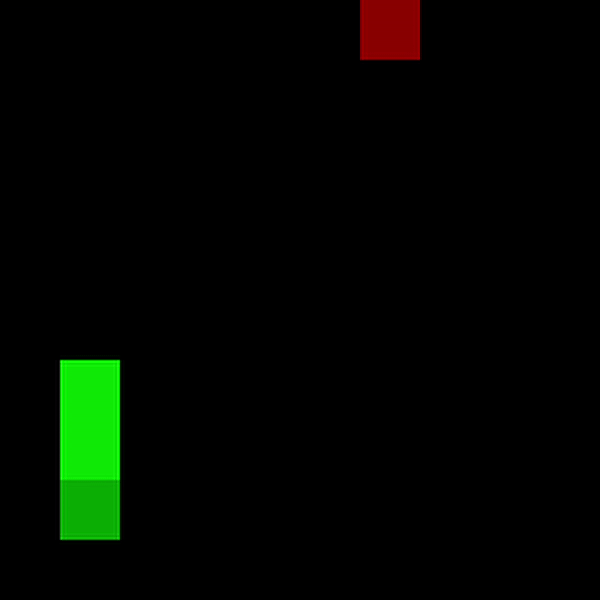

# AI for Snake

## Overview

Machine Learning and Reinforcement Learning for Snake game in Python. This project is focused on implementing AI algorithms from scratch and gain comparable performance as from model libraries like scikit-learn. Also managed to achieve results on average better than a human in the game. Algorithms implemented with Numpy and Pytorch. Each algorithm was tested in 100 games.

## Installation


```bash
pip install foobar
```

## Usage

```python
import foobar

# returns 'words'
foobar.pluralize('word')

# returns 'geese'
foobar.pluralize('goose')

# returns 'phenomenon'
foobar.singularize('phenomena')
```

## Algorithms

* ID3 - decision tree
* Naive Bayes
* Neural Network (with Pytorch)
* Q-learning

## Results

| Model  | AVG score in 100 games |
| --- | --- |
| ID3  |  |
| Naive Bayes |  |
| MLP |  |
| Q-learning |  |

### ID3
  </br>

### Naive Bayes
  </br>

### MLP
  </br>

### Q-learning
  </br>
