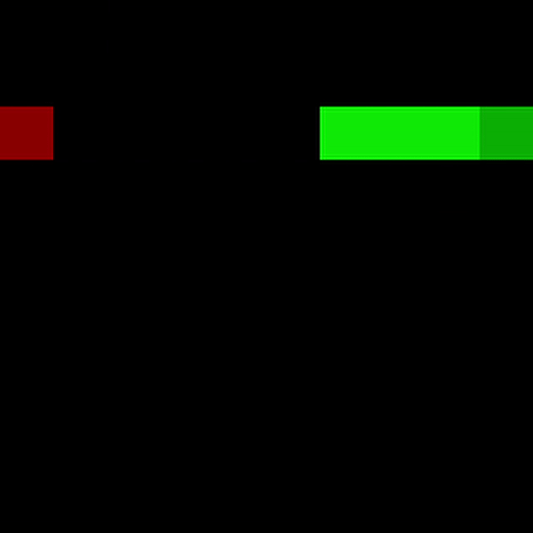

# AI for Snake

## Overview

Machine Learning and Reinforcement Learning for Snake game in Python. This project is focused on implementing AI algorithms from scratch and gain comparable performance as from model libraries like scikit-learn. Also managed to achieve results on average better than a human in the game. Algorithms implemented with Numpy and Pytorch. Each algorithm was tested in 100 games.

## Installation

```bash
pip install pip -U
pip install -r requirements.txt
```

## Usage

```python

```

## Algorithms

* ID3 - decision tree
* Random Forest
* Naive Bayes with Laplace smoothing
* Neural Network (with Pytorch)
* Q-learning

## Results

| Model  | AVG score | Min score | Max score |
| --- | --- | --- | --- |
| ID3  | 6.2 | 1 | 13 |
| Random Forest |  |  |  |
| Naive Bayes | 4.49 | 0 | 17 |
| MLP | 19.58 | 1 | 30 |
| Q-learning | 3.29 | 0 | 12 |

### ID3
<p float="left">
  
</p>

Max tree depth vs Accuracy
| max_depth | Train | Test | training time (s) |
| --- | --- | --- | --- |
| 2 | 0.42 | 0.41 | ~0.0 |
| 5 | 0.64 | 0.62 | 0.0156 |
| 6 | 0.87 | 0.84 | 0.0312 |
| 8 | 0.9594 | 0.90 | 0.0625 |
| 12 | 0.9665 | 0.90 | 0.0781 |
| 15 | 0.97 | 0.90 | 0.0937 |

### Random Forest
<!-- <p float="left">
  
</p> -->

### Naive Bayes
<p float="left">
  
</p>

Laplace smoothing influence
|  | Avg score | Min score | Max score |
| --- | --- | --- | --- |
| NB | 3.73 | 0 | 12 |
| NB + smoothing | 4.49 | 0 | 17 |

### MLP

<p float="left">
  
  
</p>

### Q-learning
<p float="left">
  
  
</p>
